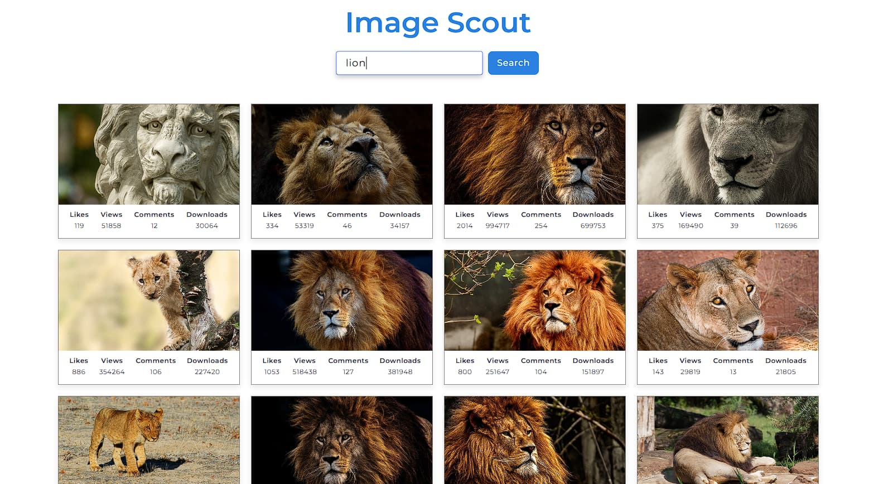
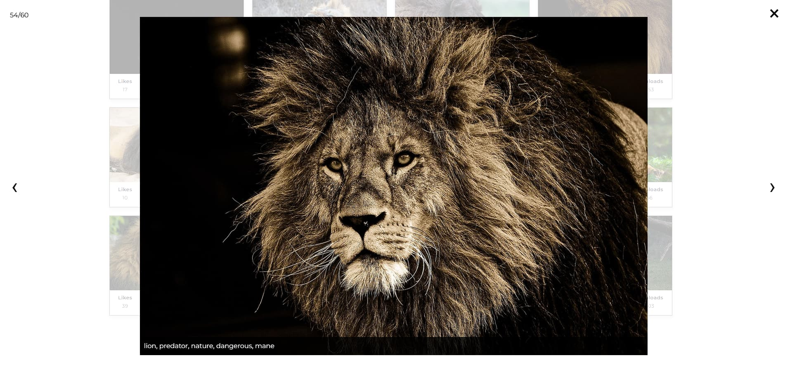
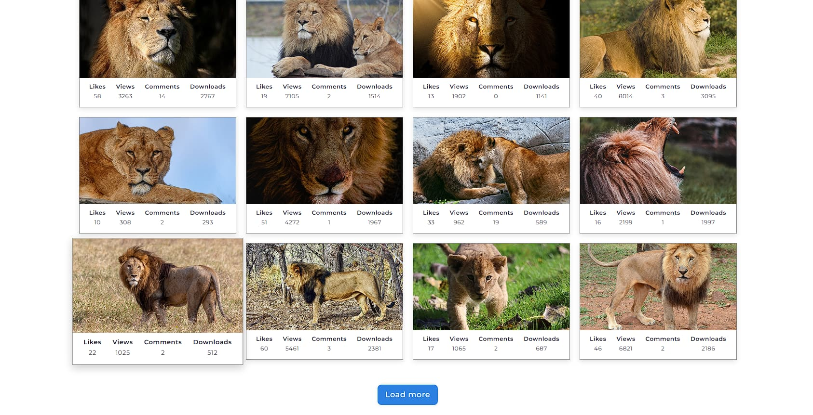

# Image Scout

**Image Scout** is a web-based image search application built using the [Pixabay API](https://pixabay.com/api/). The app allows users to search for images by tags and keywords, dynamically fetching and displaying them in a user-friendly layout.

This project focuses on modern web development practices with an emphasis on structure, maintainability, and performance. It uses Vite.js for fast bundling and hot-reloading, and the application design follows the BEM (Block Element Modifier) methodology.

## Features

- **Image Search:** Search for images by keywords or tags. The app fetches images from the Pixabay API and displays them dynamically.
- **Load More Button:** New images are loaded when the user clicks the "Load More" button, ensuring smooth browsing as the user explores the results.
- **Lightbox Preview:** Images can be previewed in a lightbox-style overlay that appears on the screen, allowing users to view images in greater detail without leaving the gallery.
- **Error Notifications:** Informational and error messages are shown using iziToast.

## Technologies Used

- [**Vite:**](https://vite.dev/) A modern build tool for fast bundling and development.
- **BEM (Block Element Modifier):** A CSS naming convention that helps in writing maintainable and scalable code.
- **Axios:** A promise-based HTTP client for making API requests.
- **iziToast:** A JavaScript library for displaying customizable toast notifications.
- **SimpleLightbox:** A lightweight, easy-to-use library for displaying images in a lightbox format.

## Key Features in Code:

- **Flexbox Layout:** Used to arrange and align images in a gallery layout, ensuring responsiveness.
- **Error Handling:** iziToast provides clear notifications for errors and information messages.
- **Modular Structure:** Code is divided into partials for better scalability and easier management.

## Screenshots:

### Gallery

### Lightbox

### Load More

## Live Demo

You can view the live demo of the application here: [Image Scout](https://przytop.github.io/image-scout/)
